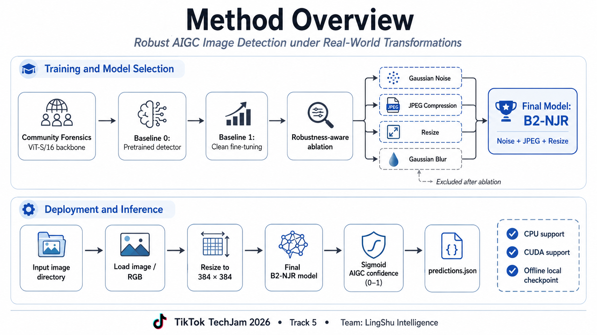
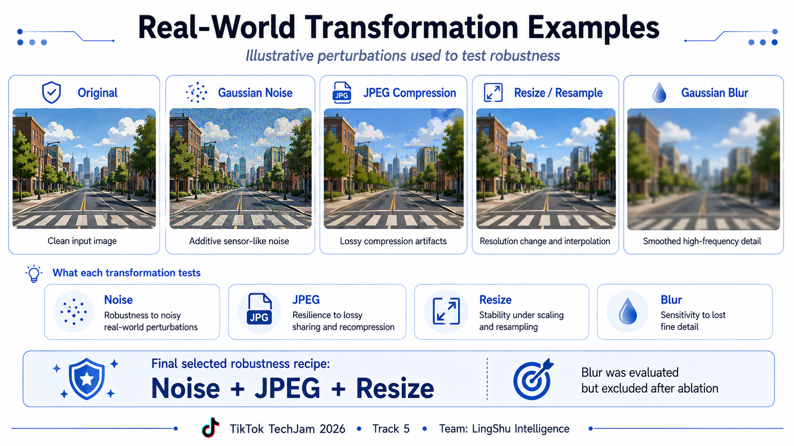
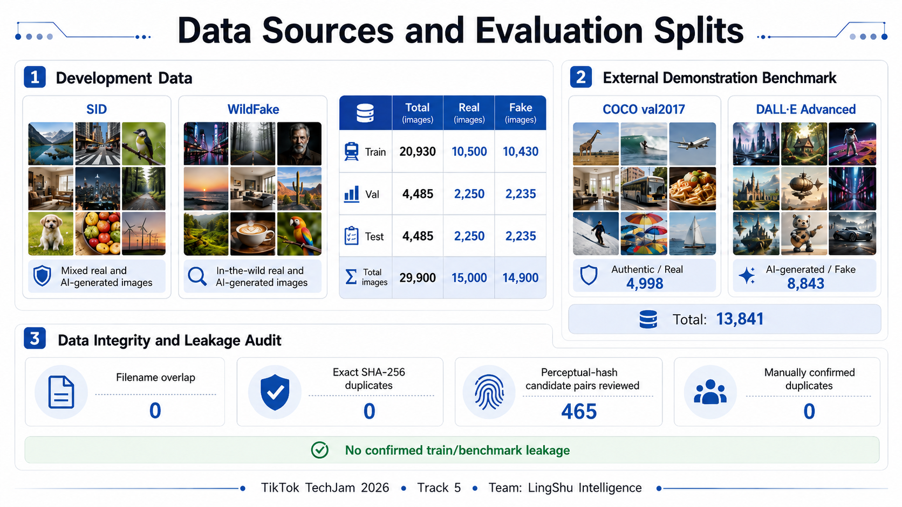
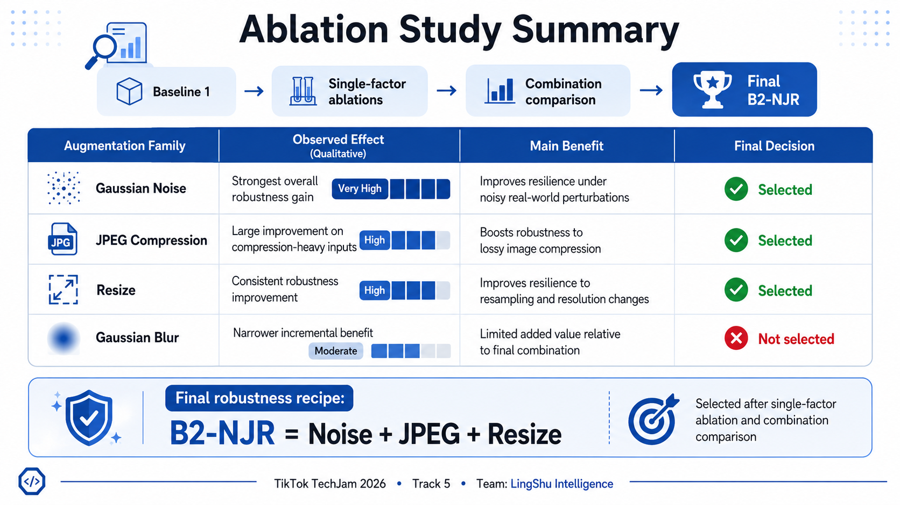
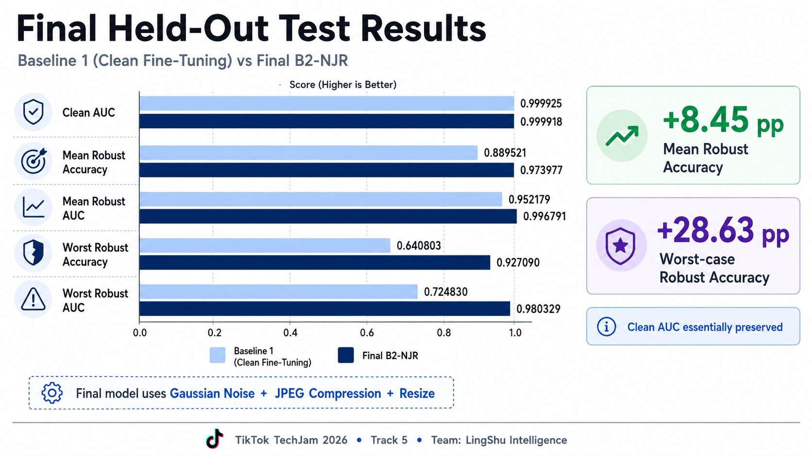
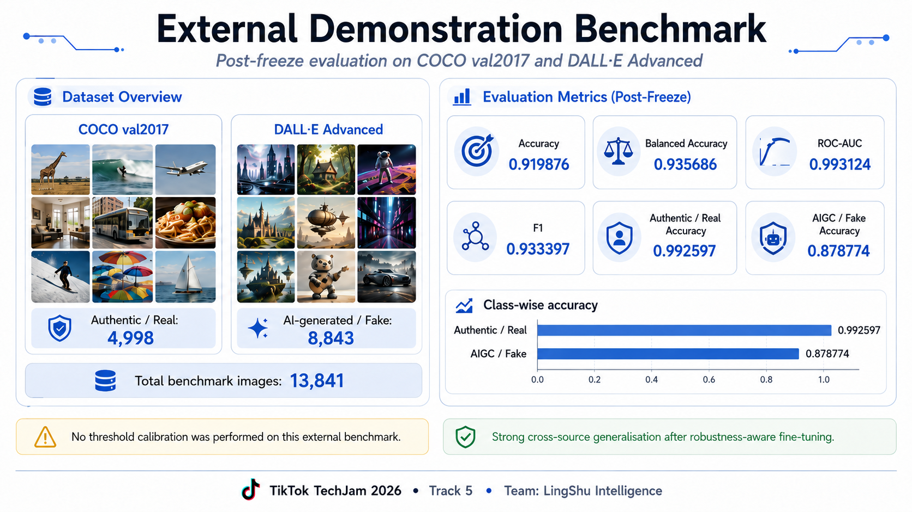

<div align="center">

# Robust AIGC Image Detector

**LingShu Intelligence · TikTok TechJam 2026 · Track 5**

Evidence-bounded, local-first detection of AI-generated images under real-world transformations.

[](https://github.com/aiden493km/LingShu-TechJam2026-Robust-AIGC-Detector/releases/tag/v1.2.0)
[](.github/workflows/web-demo-portable.yml)
[](LICENSE)
[](requirements.txt)
[](requirements.txt)
[](web_demo/package.json)
[](web_demo/package.json)
[](web_demo/package.json)
[](web_demo/README.md)
[](web_demo/README.md)
[](web_demo/README.md)
[](.github/workflows/web-demo-portable.yml)
[](.github/workflows/web-demo-portable.yml)
[](#tiktok-techjam-2026)

[**Download / Release v1.2.0**](https://github.com/aiden493km/LingShu-TechJam2026-Robust-AIGC-Detector/releases/tag/v1.2.0) · [**Frozen Checkpoint v1.0.0**](https://github.com/aiden493km/LingShu-TechJam2026-Robust-AIGC-Detector/releases/download/v1.0.0/baseline2_njr_best.pt) · [**Online Web Demo**](https://lingshu-aigc-detector.vercel.app/) · [**Results**](results/) · [**Demo Video**](https://youtu.be/uXoq2E4SNJQ)

<table>
  <caption>Frozen evaluation highlights: the first two metrics are from the held-out robustness test; ROC-AUC is from the separate external demonstration benchmark.</caption>
  <tr>
    <th scope="col">Held-out Mean Robust Accuracy</th>
    <th scope="col">Held-out Worst-case Robust Accuracy</th>
    <th scope="col">External Demonstration ROC-AUC</th>
  </tr>
  <tr>
    <td><strong>0.973977</strong></td>
    <td><strong>0.927090</strong></td>
    <td><strong>0.993124</strong></td>
  </tr>
</table>

**Final model: B2-NJR = Gaussian Noise + JPEG Compression + Resize**

</div>

---

**Contents:** [At a Glance](#at-a-glance) · [Problem and Method](#problem-and-method) · [Data Sources and Evaluation Protocol](#data-sources-and-evaluation-protocol) · [Robustness Ablation](#robustness-ablation) · [Final Held-Out Test](#final-held-out-test) · [External Demonstration Benchmark](#external-demonstration-benchmark) · [Data Integrity and Leakage Audit](#data-integrity-and-leakage-audit) · [Error Analysis](#error-analysis) · [Deployment and Web Demo](#deployment-and-web-demo) · [Quick Start](#quick-start) · [Reproducing Final Evaluation](#reproducing-the-final-evaluation) · [Limitations and Future Work](#limitations-and-future-work) · [Team Contributions](#team-contributions) · [Repository Structure](#repository-structure) · [Third-Party Attribution](#third-party-attribution) · [License](#license)

---

## At a Glance

- **Directory → confidence JSON** inference for every image.
- **Community Forensics ViT-S/16**, 384 × 384 input.
- Systematic **Noise / JPEG / Resize / Blur ablation** before selecting the final augmentation recipe.
- **Mean Robust Accuracy: 0.973977** on the frozen held-out test.
- **Worst-case Robust Accuracy: 0.927090**.
- **External ROC-AUC: 0.993124** on COCO val2017 + DALL·E Advanced.
- **CPU / CUDA / local-checkpoint inference** supported.
- **Clone-and-run offline WebDemo** with browser-side FP32 inference and no inference server.



---

## Problem and Method

The goal is not only to separate Real vs. AIGC images on clean inputs, but to preserve detection quality after realistic post-processing. We therefore treat robustness as a model-selection problem rather than blindly stacking every available augmentation.

Our development path was:

**Pretrained detector → clean domain fine-tuning → single-factor robustness ablations → combination selection → frozen B2-NJR → held-out test → external demonstration benchmark**



---

## Data Sources and Evaluation Protocol

Development data uses **SID + WildFake** with designated train, validation, and
held-out test splits.

The [Chinese data-processing and robustness-evaluation pipeline report](docs/Track5_数据处理与鲁棒性评测管线说明.docx)
documents the source-layer sampling, labels and metadata, split and duplicate
audits, deterministic 384 × 384 preprocessing, Baseline 1 / Baseline 2 data
construction, robustness protocol, and external-demo isolation used for project
handoff. It is explanatory documentation, not a bundled dataset or a replacement
for the committed scripts and machine-readable results. Dataset files and the
original training manifests are not redistributed in this repository.

The external post-freeze demonstration benchmark contains:

- **COCO val2017:** 4,998 authentic images
- **DALL·E Advanced:** 8,843 AI-generated images
- **Total:** 13,841 images



The external benchmark is **report-only**: it was not used for training, model selection, or threshold calibration.

---

## Robustness Ablation

We evaluated four single-factor robustness variants from the same pretrained starting point:

- **B2-N:** Gaussian Noise
- **B2-J:** JPEG Compression
- **B2-R:** Resize
- **B2-B:** Gaussian Blur

Noise gave the strongest global robustness gain. JPEG and Resize provided complementary benefits for compression and severe downsampling. Blur improved blur-specific performance but delivered limited global benefit and was excluded from the final recipe.



### Validation ablation matrix

| Model | Clean AUC | Mean Robust Acc | Mean Robust AUC | Worst Acc | Worst AUC | Decision |
|---|---:|---:|---:|---:|---:|---|
| B1 Clean FT | 0.999824 | 0.888565 | 0.950910 | 0.642140 | 0.724042 | Baseline |
| B2-N | 0.999793 | **0.958178** | **0.994884** | **0.833222** | **0.977746** | Keep |
| B2-J | 0.999679 | 0.918872 | 0.969286 | 0.672910 | 0.776991 | Keep |
| B2-R | 0.999771 | 0.912311 | 0.956829 | 0.689186 | 0.735082 | Keep |
| B2-B | 0.999773 | 0.894888 | 0.953336 | 0.658417 | 0.719815 | Exclude |
| **B2-NJR** | **0.999729** | **0.972750** | **0.996291** | **0.920624** | **0.978437** | **Final** |

<details>
<summary><strong>More quantitative experiment details</strong></summary>


### Final training mixture

The candidate augmentation pool contained Clean, Noise, JPEG, and Resize samples,
while each epoch was capped at **20,930 samples / 655 batches** to keep optimizer-
update counts comparable with Baseline 1. The exact final per-transform sampling
composition depends on the original training manifest, which is not distributed in
this repository, so no finer composition claim is made here.

</details>

---

## Final Held-Out Test

The final augmentation recipe, checkpoint, epoch, and threshold were frozen **before** the held-out test was evaluated.



| Metric | Baseline 1 | Final B2-NJR | Change |
|---|---:|---:|---:|
| Clean AUC | 0.999925 | **0.999918** | -0.000006 |
| Mean Robust Accuracy | 0.889521 | **0.973977** | **+8.45 pp** |
| Mean Robust AUC | 0.952179 | **0.996791** | +0.044612 |
| Worst Robust Accuracy | 0.640803 | **0.927090** | **+28.63 pp** |
| Worst Robust AUC | 0.724830 | **0.980329** | +0.255499 |

The hardest final condition remained **Gaussian Noise σ = 0.10**, but its accuracy improved from **0.6408 → 0.9271** relative to Baseline 1.

Other severe-condition improvements include:

| Condition | B1 Accuracy | Final B2-NJR Accuracy |
|---|---:|---:|
| Noise σ=0.10 | 0.6408 | **0.9271** |
| JPEG q30 | 0.8337 | **0.9561** |
| Resize ×0.25 | 0.8042 | **0.9445** |
| Blur σ=2.0 | 0.9101 | **0.9478** |

Detailed machine-readable results are under [`results/final_test/`](results/final_test/) and [`results/ablation/`](results/ablation/).

---

## External Demonstration Benchmark

After model freeze, we evaluated cross-source generalisation on **COCO val2017 + DALL·E Advanced** without recalibrating the threshold.



| Metric | B2-NJR |
|---|---:|
| Accuracy | **0.919876** |
| Balanced Accuracy | **0.935686** |
| ROC-AUC | **0.993124** |
| F1 | **0.933397** |
| Authentic / Real Accuracy | **0.992597** |
| AIGC / Fake Accuracy | **0.878774** |

Detailed outputs are under [`results/official_demo/`](results/official_demo/).

---

## Data Integrity and Leakage Audit

Before external evaluation, we audited potential overlap between development data and the external benchmark.

| Check | Result |
|---|---:|
| Filename overlap | **0** |
| Exact SHA-256 duplicates | **0** |
| Perceptual-hash candidate pairs reviewed | **465** |
| Manually confirmed duplicates | **0** |

Compact audit outputs are available under [`results/data_integrity/`](results/data_integrity/).

---

## Error Analysis

All error analysis uses the frozen B2-NJR checkpoint and the validation-selected threshold `0.55657113`. No model setting or threshold was retuned on the held-out test set.

### Clean held-out errors

On the 4,485-image clean held-out test set, B2-NJR makes only **19 errors**: **6 false positives** and **13 false negatives**.

| Metric | Result |
|---|---:|
| Accuracy | 99.5764% |
| False positives | 6 |
| False negatives | 13 |
| FPR | 0.2667% |
| FNR | 0.5817% |

Representative cases were selected as confidence extremes and manually inspected. They are descriptive examples rather than a random sample, and should not be interpreted as causal evidence or as representative of all 19 errors.

### Transformation-specific failure directions

| Condition | Accuracy | FP | FN | FPR | FNR |
|---|---:|---:|---:|---:|---:|
| Clean | 99.58% | 6 | 13 | 0.27% | 0.58% |
| JPEG q30 | 95.61% | 97 | 100 | 4.31% | 4.47% |
| Blur σ=2.0 | 94.78% | 225 | 9 | 10.00% | 0.40% |
| Resize ×0.25 | 94.45% | 11 | 238 | 0.49% | 10.65% |
| Noise σ=0.10 | 92.71% | 204 | 123 | 9.07% | 5.50% |

The error directions differ by transformation:

- Strong blur is mainly **false-positive dominant**.
- Severe downsampling is mainly **false-negative dominant**.
- Strong Gaussian noise increases both error types.

This asymmetric behavior explains why a single global threshold cannot independently optimize every corruption condition.

Relative to the clean-only B1 model, B2-NJR reduces errors under noise σ=0.10 from **1,611 to 327**. It fixes 1,455 B1 failures while introducing 171 new errors, for a net reduction of **1,284 errors (79.7%)**. The clean-set trade-off is small: B1 makes 16 clean errors, while B2-NJR makes 19.

A complete discussion, including representative high-confidence false positives and false negatives, is provided in **Section 8 of the technical report**.

Machine-readable evaluation outputs are available in:

- [`results/final_test/`](results/final_test/)
- [`results/official_demo/`](results/official_demo/)
- [`b2_official_demo_error_candidates.csv`](results/official_demo/b2_official_demo_error_candidates.csv)

## Deployment and Web Demo

### Online Web Demo

Open the hosted [LingShu Online Web Demo](https://lingshu-aigc-detector.vercel.app/)
to run the detector directly in a supported browser without installing or
downloading the repository. The production site downloads the frozen FP32 ONNX
model on first load, verifies its identity before creating the inference session,
and then runs inference locally in the browser with WebGPU-first and WASM-fallback
execution. Selected images remain in browser memory and are not uploaded.

### Offline Web Demo: judge quick start

| Windows x86-64 | macOS on Apple Silicon |
|---|---|
| Clone or fully extract the repository, double-click `web_demo/start-demo.bat`, wait for the printed `READY` URL, then select an image. | Clone or fully extract the repository, double-click `web_demo/start-demo.command`, wait for the printed `READY` URL, then select an image. |

Both launchers use a bundled CPython runtime and the included browser application.
Judges do not need to install Python, Node.js, npm packages, or an inference server,
and normal use is offline after the repository is obtained. This portable slice is
packaged for Windows x86-64 and Apple Silicon macOS; Intel macOS is not packaged in
this slice.

Use the [v1.2.0 release page](https://github.com/aiden493km/LingShu-TechJam2026-Robust-AIGC-Detector/releases/tag/v1.2.0)
for portable local-release downloads and release notes. The frozen Python checkpoint
remains on the separate v1.0.0 release linked below.

The demo uses exactly `baseline2_njr_fp32.onnx` at the frozen threshold
`0.55657113`. The first launch verifies and extracts the platform runtime to
`web_demo/.runtime-cache/`; later launches reuse that cache. The local server is
loopback-only at `127.0.0.1`: it tries ports 8765–8784 and then an operating-system
ephemeral port. The selected image stays in the browser and is not uploaded to the
local server or an external service.

Keep the launcher window open. Press `Ctrl+C` there or close the launcher window
to stop the server. Pass `--check` to verify the portable package without opening
a port, or `--no-browser` to print the local URL without opening a browser.

If macOS Gatekeeper blocks the bundled interpreter, open **System Settings →
Privacy & Security → Open Anyway**, then retry `start-demo.command`. The portable
CI smoke checks the launchers and package on both operating systems; it is not a
substitute for a Finder double-click or real browser inference.

The WebDemo runs browser-side inference: WebGPU is attempted first and
automatically falls back to WASM with the same FP32 ONNX file.

The committed acceptance record covers source and Unicode-path fresh-copy runs,
WebGPU, automatic fallback, and forced WASM: 90 browser inferences with zero frozen-
threshold flips and a maximum absolute probability error of `0.002465222` against
the recorded FP32 references. This is deployment-parity evidence, not a new
accuracy benchmark.

[Judge and developer guide](web_demo/README.md) ·
[Formal acceptance evidence](results/web_demo_acceptance/README.md)

The committed WebDemo now uses the reference-locked **Semantic Signal** interface:
Detector is the default route, while Technology, Results, Error Analysis, and
About remain directly reachable without reloading the model. Successful results
are retained as an in-memory three-image session history, and the title-to-analysis
transition preserves the same local-only inference and privacy boundary described
above. See the [WebDemo guide](web_demo/README.md) for interaction details.

### Frozen deployment artifacts

| Workflow | Artifact | Distribution | SHA-256 |
|---|---|---|---|
| Python CLI / evaluation | `baseline2_njr_best.pt` | [Release `v1.0.0`](https://github.com/aiden493km/LingShu-TechJam2026-Robust-AIGC-Detector/releases/tag/v1.0.0) | `9348c210f1612b4c78d74dde5e717b69e90274cbbf6fa60c4b893946409658ba` |
| Local browser WebDemo | `baseline2_njr_fp32.onnx` | [Portable Release `v1.2.0`](https://github.com/aiden493km/LingShu-TechJam2026-Robust-AIGC-Detector/releases/tag/v1.2.0); source model remains ordinary Git under `web_demo/models/` | `e2cdc94a06a7a7f72c763d46a92ef3ce84675fd9ae6a4664c94c6f5d99b66b69` |

For the Python CLI, place the downloaded checkpoint at:

```text
checkpoints/baseline2_njr_best.pt
```

---

## Quick Start

### Install

The recorded training and evaluation environment used Python 3.12.8 and PyTorch
2.10.0. The command below installs the repository requirements for a local setup.

```bash
pip install -r requirements.txt
```

### Run inference

```bash
python inference.py \
  --input ./demo_images \
  --output ./results/predictions.json \
  --checkpoint ./checkpoints/baseline2_njr_best.pt \
  --device auto \
  --pretty
```

Windows PowerShell:

```powershell
python .\inference.py `
  --input ".\demo_images" `
  --output ".\results\predictions.json" `
  --checkpoint ".\checkpoints\baseline2_njr_best.pt" `
  --device auto `
  --pretty
```

For memory-constrained CPU machines:

```bash
python inference.py \
  --input ./demo_images \
  --output ./results/predictions.json \
  --checkpoint ./checkpoints/baseline2_njr_best.pt \
  --device cpu \
  --batch-size 4 \
  --pretty
```

### Output

```json
[
  {
    "image_path": "example.jpg",
    "pred": 0.987654
  }
]
```

`pred ∈ [0,1]` is the continuous confidence that the image is AI-generated.

The frozen threshold `0.55657113` is used for Real/AIGC classification summaries, while the JSON preserves the continuous score.

---

## Reproducing the Final Evaluation

The portable final-test script accepts command-line paths rather than machine-specific absolute paths:

```bash
python eval_baseline2_final_test.py \
  --val-root /path/to/val \
  --test-root /path/to/test \
  --b1-checkpoint /path/to/baseline1_clean_best.pt \
  --b2-checkpoint ./checkpoints/baseline2_njr_best.pt \
  --output-dir ./results/final_test \
  --device auto \
  --batch-size 32
```

Dataset files are not redistributed in this repository. Obtain the datasets from their original sources and follow the directory layout expected by the scripts.

---

## Limitations and Future Work

- **Strong Gaussian noise remains the hardest tested transformation.** Robustness is substantially improved, but not perfect.
- The external demonstration benchmark covers **COCO authentic images and DALL·E Advanced generated images**; broader generator/source coverage would strengthen external-generalisation claims.
- A threshold selected on clean validation data can experience **score-distribution / calibration shift** on new sources, even when ROC-AUC remains high.
- The current system provides **image-level detection only**; it does not localise manipulated regions or identify the generator.
- Future work would include mixed/composed corruptions, broader unseen-generator evaluation, confidence calibration / uncertainty estimation, and more efficient deployment.

---

## Team Contributions

| Team member | Role | Contribution | GitHub |
|---|---|---|---|
| Jingxuan Qian | Model Training & Analysis | Led model training, fine-tuning, checkpoint selection, and the B2-NJR error-analysis report. | [@aiden493km](https://github.com/aiden493km) |
| Tianshi Bu | Dataset & Preprocessing | Prepared the Track5Data training and evaluation sets, 384 px preprocessing, and clean, robust, and ablation data support. | [@Tianshi-Bu](https://github.com/Tianshi-Bu) |
| Zhiyi Li | Full-Stack Web Delivery | Built the end-to-end WebDemo and dual delivery stack: FP32 model conversion, WebGPU/WASM inference, product UI, offline packaging, Vercel deployment preparation, model-delivery integrity verification, and acceptance testing. | [@Awes0meE](https://github.com/Awes0meE) |
| Mingxuan Chen | Video & Communications | Leads video editing, promotional storytelling, and submission media for the project. | [@CharlieC007](https://github.com/CharlieC007) |

The About-page roster uses the four approved, user-supplied portraits stored
locally under `web_demo/public/team/`. The exact member-to-image mapping is fixed
by `docs/superpowers/specs/2026-08-31-team-portraits-design.md`; no stock,
generated, retouched, or inferred replacement portraits are used.

---

## Repository Structure

```text
.
├── AGENTS.md
├── LICENSE
├── README.md
├── requirements.txt
├── requirements-web-experiment.txt
├── .gitignore
├── THIRD_PARTY_NOTICES.md
├── inference.py
├── models.py
├── train_baseline1_clean.py
├── train_baseline2_ablation.py
├── eval_baseline2_final_test.py
├── eval_official_demo_benchmark.py
├── check_official_benchmark_leakage.py
├── make_near_duplicate_review.py
├── finalize_near_duplicate_review.py
├── checkpoints/
│   └── README.md
├── demo_images/
├── assets/
│   └── figures/
├── browser_benchmark/
├── docs/
│   ├── Track5_数据处理与鲁棒性评测管线说明.docx
│   └── superpowers/
├── results/
│   ├── ablation/
│   ├── final_test/
│   ├── official_demo/
│   ├── data_integrity/
│   ├── web_demo_acceptance/
│   └── web_model_experiment/
├── tests/
├── third_party/
│   └── Community-Forensics-LICENSE
└── web_demo/
    ├── start-demo.bat
    ├── models/
    ├── dist/
    ├── src/
    └── README.md
```

---

## Third-Party Attribution

This work builds on **Community Forensics** and the `OwensLab/commfor-model-384` detector.

See [`THIRD_PARTY_NOTICES.md`](THIRD_PARTY_NOTICES.md) and [`third_party/Community-Forensics-LICENSE`](third_party/Community-Forensics-LICENSE) for attribution and licensing information.

`THIRD_PARTY_NOTICES.md` is an evidence inventory, not a legal certification. Its
model/dataset provenance remains an explicitly accepted, unresolved redistribution
risk. The complete runtime notices were verified in the published v1.2.0 packages;
that packaging verification does not make the unresolved provenance legally cleared.

---

## TikTok TechJam 2026

**Track 5 — Robust Detection of AI-Generated Images Under Real-World Transformations**<br>
**Team — LingShu Intelligence**

---

## License

Original LingShu Intelligence project code and original documentation are licensed under [MIT License](LICENSE), unless an individual file states otherwise.

Third-party code, model components, datasets, codecs, browser dependencies, and bundled runtimes remain under their respective licenses and terms; root MIT does not relicense them. Preserve [`THIRD_PARTY_NOTICES.md`](THIRD_PARTY_NOTICES.md), [Community Forensics license](third_party/Community-Forensics-LICENSE), and applicable dependency/runtime notices when redistributing.
